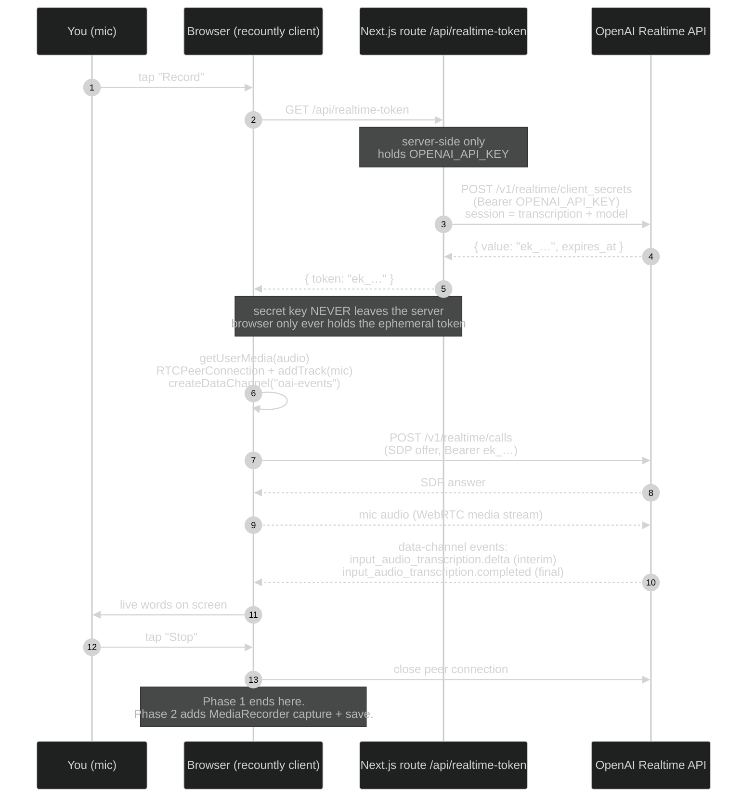
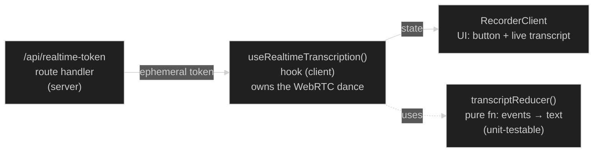

# Phase 1 — Live transcription (design)

> **ARCHIVED — historical design doc, executed and superseded.** Phase 1 shipped and was
> verified. For the current state of the system see `CLAUDE.md` and the code in `src/`; this
> file is kept only as a record of the original design. ⚠️ **Do not trust the model name
> below:** this doc proposes `gpt-realtime-whisper`, which turned out to be **bogus** — it
> mints a token fine, then `/v1/realtime/calls` hangs ~15s → a Cloudflare 504 the browser
> misreports as a CORS error (cost a session to diagnose). Verified-good transcription
> models: **`gpt-4o-transcribe`**, `gpt-4o-mini-transcribe`, `whisper-1`.

**Goal (the core bet):** tap Record, speak, and watch your words appear on screen in
real time. Persistence is **stubbed** — Phase 1 is done when live words render. No saving,
no database, no audio upload yet (those are Phase 2).

> ⚠️ The OpenAI Realtime API changes often, and its own docs are currently inconsistent
> across versions (the old `POST /v1/realtime/transcription_sessions` is deprecated in favor
> of the GA `client_secrets` flow; field names differ between doc pages). The shapes below
> are the reconciled GA flow as of research on 2026-06-01, but we **verify empirically in a
> spike before trusting any of it** — see "Build approach" at the bottom.

---

## The key architectural idea

Your server is **never in the audio path**. It only mints a short-lived token. The browser
streams audio **directly** to OpenAI and gets transcripts back directly. This is what makes
the whole thing work on Vercel's serverless model (no long-lived server connections) and is
why the secret `OPENAI_API_KEY` never reaches the browser — only a ~1-minute ephemeral token.



---

## Verified API specifics (reconciled GA flow, verify in spike)

**1. Mint ephemeral token (server, in the route handler):**
- `POST https://api.openai.com/v1/realtime/client_secrets`
- Header: `Authorization: Bearer ${OPENAI_API_KEY}`
- Body carries the session as a **transcription** session with the model + config, e.g.:
  ```json
  {
    "session": {
      "type": "transcription",
      "audio": {
        "input": {
          "transcription": { "model": "gpt-realtime-whisper", "language": "en" },
          "turn_detection": { "type": "server_vad" }
        }
      }
    }
  }
  ```
- Response contains the ephemeral token value (`value`, ~`ek_…`) and an `expires_at`
  (~60s). The route returns only that token to the browser.

**2. Browser connects via WebRTC:**
- `getUserMedia({ audio: true })` → `RTCPeerConnection` → `addTrack(micTrack)`
- `pc.createDataChannel("oai-events")` (named channel that carries JSON events)
- `createOffer()` → `setLocalDescription()`
- `POST https://api.openai.com/v1/realtime/calls` with `Content-Type: application/sdp`,
  `Authorization: Bearer ${ephemeralToken}`, body = `offer.sdp`
- Response is the SDP answer → `setRemoteDescription()`

**3. Transcript events arrive on the `oai-events` data channel:**
- `conversation.item.input_audio_transcription.delta` → field `delta` = newly available
  interim text
- `conversation.item.input_audio_transcription.completed` → field `transcript` = final text
  for a committed segment
- Both include `item_id` so deltas can be grouped per segment.

**Model choice:** `gpt-realtime-whisper` — natively streaming, tunable latency, built for
realtime. Alternatives if accuracy/latency disappoint: `gpt-4o-transcribe` (higher accuracy,
more latency) or `gpt-4o-mini-transcribe`. Model is set **server-side** in the token request,
so we can tune it without shipping client changes.

---

## Components we build (small, isolated units)



- **`src/app/api/realtime-token/route.ts`** — server route. Reads `OPENAI_API_KEY`, calls
  `client_secrets`, returns `{ token }`. The only place the secret lives. Sets a safety
  identifier and short expiry. ~30 lines.
- **`src/lib/realtime/transcript-reducer.ts`** — a **pure function** mapping the stream of
  `delta`/`completed` events to display state (committed text + current interim text). No
  WebRTC, no DOM. This is the piece we **TDD** — it's where the real logic lives and it's
  fully testable without a network.
- **`src/lib/realtime/useRealtimeTranscription.ts`** — a React hook wrapping the gnarly
  WebRTC setup/teardown. Exposes `{ status, committed, interim, start(), stop(), error }`.
  Isolates all the browser-API mess behind a clean interface.
- **`src/app/page.tsx` / a `RecorderClient` component** — mobile-first UI: a big Record
  button and a transcript area that shows committed text solid and interim text dimmed.

---

## Decisions to confirm

1. **Model:** start with `gpt-realtime-whisper` (lowest latency). Agree?
2. **MediaRecorder now or Phase 2?** We only need words on screen for Phase 1. Recommend
   **not** adding audio capture/recording yet — keep Phase 1 minimal, add MediaRecorder on
   the same mic stream in Phase 2. Agree?
3. **Segmentation:** use `server_vad` so OpenAI auto-commits segments on natural pauses
   (good for monologue journaling — you get finals as you breathe). Agree?
4. **Where the page lives:** replace the Phase 0 landing `page.tsx` with the recorder, or
   keep landing and put the recorder at `/record`? Recommend recorder **becomes the home
   page** — this is a single-purpose tool.

---

## Build approach (verify-first)

Because the API is shifty, we don't write the whole thing then debug. Order:

1. **Spike the token route** — hit `client_secrets` from the server, confirm we get an
   ephemeral token back. Verifies auth + endpoint shape before any browser code.
2. **Spike the connection** — minimal browser code: token → WebRTC → log raw data-channel
   events to the console. Confirms the event names/shapes against reality.
3. **TDD the reducer** — once we know the real event shapes, write tests, then the pure
   `transcriptReducer`.
4. **Wire the hook + UI** — assemble into the live experience.
5. **Demo:** talk, watch words appear, on desktop then on the phone.

Phase 1 is "done" only when you can open the URL on your phone, tap Record, and see your
words appear live.
```

